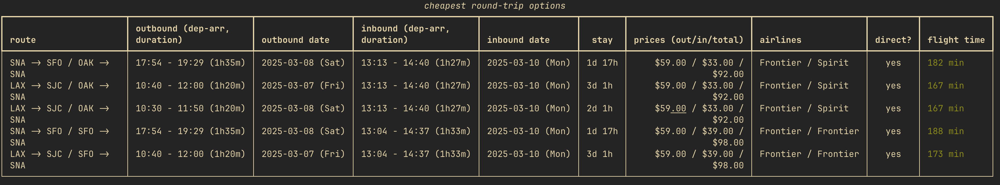

# findflights

This simple command line app automates the process of searching various sites
for the cheapest flights. 

For example, if you want to travel from Southern California to the Bay Area and *only* care about
the flight price, you can run

```bash
findflights --depart '3/7-3/8' --return '3/9-3/10' LAX,SNA SFO,OAK,SJC
```

This will do the following:

1. Find every departure flight possible within the return date range, from
    - LAX to SFO
    - SNA to SFO
    - SNA to OAK
    - LAX to OAK
    - SNA to SJC
    - LAX to SJC
    
2. Find every return flight possible within the return date range, from
    - SFO to LAX
    - SFO to SNA
    - OAK to SNA
    - OAK to LAX
    - SJC to SNA
    - SJC to LAX

3. Find every pair of (departure, return) flights, like
    - (LAX to SFO, SFO to LAX)
    - (LAX to SFO, SFO to SNA)
    - ...
    - (SNA to SJC, OAK to LAX)
    - ...
    - (LAX to SJC, SJC to LAX)

4. Sort them by total price, and display the results in a table like this:



## Installation

```
pip install findflights
```

## Usage

```
findflights --help
```

```
usage: main.py [-h] --depart DEPART --return RETURN_RANGE [--top TOP] [--sort {price,total time}] [--exclude EXCLUDE]
               [--save-csv SAVE_CSV] [--depart-time-range DEPART_TIME_RANGE] [--direct | --no-direct] [--workers WORKERS]
               origin destinations

Find the cheapest/fastest flights (using Skiplagged)!

positional arguments:
  origin                comma separated candidate source airports (e.g. SAN,SNA,LAX)
  destinations          comma separated candidate destination airports (e.g. SFO,OAK,SJC)

options:
  -h, --help            show this help message and exit
  --depart DEPART       outbound date range (e.g. 3/7-3/8)
  --return RETURN_RANGE
                        return date range (e.g. 3/9-3/10)
  --top TOP             number of top results to show (default 5)
  --sort {price,total time}
                        metric to sort by (default price)
  --exclude EXCLUDE     comma separated list of airlines to exclude (default none)
  --save-csv SAVE_CSV   path to save full sorted results as csv (default none)
  --depart-time-range DEPART_TIME_RANGE
                        filter outbound departures within time range, e.g. '08:00-12:00'
  --direct              only show direct flights (default)
  --no-direct           include flights with stops
  --workers WORKERS     number of threadpool workers (default 5)
```
